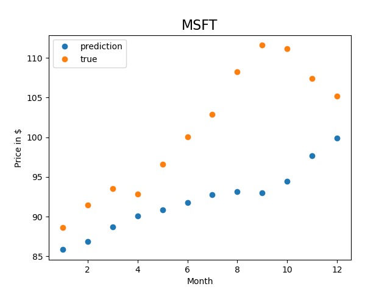

# A Stock Rating App

This stock rating app uses the social media data (LinkedIn, Facebook, etc.) to predict the possible stock movement and make stock ratings in the coming year. It offers a perspective and reference to investors when they are trading stocks. This web app is published at [https://asrapp.herokuapp.com](https://asrapp.herokuapp.com/).

## Data set
The LinkedIn and Facebook data set were obtained from Gigabyte level CSV fiels. Preprocessing on this data set was done to keep only NASDAQ-100 companies, and the `like_count` and `follower_count` features associated to those companies. The preprocessed data are about ~ 6 MB large, stored in directory _datalab_ in this repo.

The stock data set are weekly historical data pulled from AlphaVantage using it's API, and only those of NASDAQ-100 companies are considered. The stock data set is stored in directory _nasdaq100_ in this repo.

A standalone file to match a company's name across all above data sets is written in `nasdaq100_lk_fb_names.csv`

## Visualizations
When searching in the app, only a line plot made from `Altair` is returned in the spirit of simplicity. In the meantime, for the benefit of debugging, a scatter plot can be made from `matplotlib` in the back-end of the app. Both of the visulization code are implemented in `make_prediction.py`.

Bad: R_square score = 0.13 | Good: R_square score = 0.85 | Good: R_square score = 0.99 |
:-------------------------:|:---------------------------:|:---------------------------:|
               |                |                |

## Prediction model
With the `like_count` and `follower_count` features of the previous year (i.e. 2016) and the stock price of the following year (i.e. 2017) as input,  a `LinearRegression` model from `sklearn` is trained. Then, the `like_count` and `follower_count` features of the following year (i.e. 2017) is used as input to the trained model to predict the stock movement in the coming year (i.e. 2018), as shown in the plot returned by search.

Another linear fit on the predicted stock data is made to obtain the slope of the fit which is then used to rate this stock as "Increasing", "Decreasing", or "Remaining same". The standard of the rating based on the fitted slope is summarized in the table below.

|Increasing    | Decreasing	    | Remaining same   	  |
|--------------|--------------------|---------------------|
| slope > 0.1  | slope < -0.1       | -0.1 < slope < 0.1  |

## Step to run on local machine
* export FLASK_APP=hello.py
* export FLASK_ENV=development
* flask run

## Reference link
* [how-to-post-the-output-result-on-the-same-page-in-flask-app](https://stackoverflow.com/questions/46698134/how-to-post-the-output-result-on-the-same-page-in-flask-app)
* [flask-post-to-the-same-page](https://stackoverflow.com/questions/37211791/flask-post-to-the-same-page)
* [flask-quickstart](https://flask.palletsprojects.com/en/1.1.x/quickstart/)

